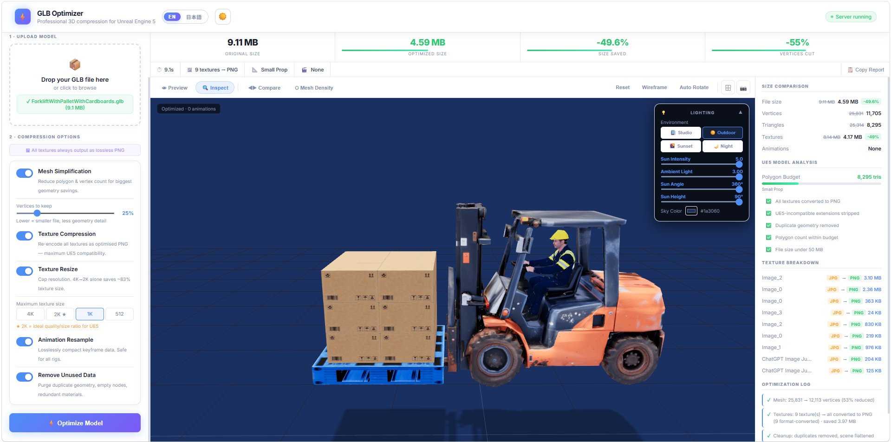

<div align="center">

# 🧊 GLB Optimizer

### Compress `.glb` 3D models for Unreal Engine 5 — with a real-time 3D viewer, side-by-side comparison, and a per-mesh inspector.

A **100% local**, browser-based tool that shrinks bloated glTF assets without ever uploading them anywhere. Drop in a model, tune the settings, watch the savings happen live, and download a clean, UE5-ready `.glb`.

<br/>


<br/>



<sub>Live workflow: upload → optimize → compare → download. The example above takes a model from <strong>9.11 MB → 4.59 MB (−49.6%)</strong>.</sub>

</div>

---

## ✨ Highlights

- 🪶 **Real compression** — mesh simplification (meshoptimizer), texture downscaling, animation resampling, and dead-data pruning, all powered by [glTF Transform](https://gltf-transform.dev/).
- 🎮 **UE5-first** — automatically strips extensions Unreal Engine 5 can't import (`EXT_meshopt_compression`, `EXT_texture_webp`, `KHR_texture_basisu`) so your file imports cleanly the first time.
- 👁 **Built-in 3D viewer** — four inspection modes powered by Three.js: **Preview**, **Inspect**, **Compare**, and **Mesh Density**.
- ◀▶ **Before/After compare** — a draggable split-screen slider shows the original and optimized model side by side, in the same scene.
- 🔍 **Per-mesh inspector** — click any mesh to see its triangle count and share of the total scene.
- 📊 **Live stats** — file size, vertex/triangle counts, texture breakdown, and a step-by-step optimization log update in real time.
- 🌅 **Studio lighting presets** — Studio, Outdoor, Sunset, and Night, plus adjustable sun position and sky color.
- 🌐 **Bilingual UI** — full **English / 日本語** support, toggleable in one click.
- 🔒 **Fully offline** — everything runs on `localhost`. Your models never leave your machine.

---

## 📑 Table of Contents

- [Quick Start](#-quick-start)
- [How It Works](#-how-it-works)
- [The 3D Viewer](#-the-3d-viewer)
- [Optimization Options](#-optimization-options)
- [Simplify Ratio Guide](#-simplify-ratio-guide)
- [Tech Stack](#-tech-stack)
- [Project Structure](#-project-structure)
- [Tips & FAQ](#-tips--faq)

---

## 🚀 Quick Start

> **Requirements:** [Node.js](https://nodejs.org/) 18 or newer.

```bash
# 1. Install dependencies (only needed once)
npm install

# 2. Start the local server
npm start

# 3. Open the app in your browser
#    → http://localhost:3000
```

Stop the server any time with `Ctrl + C`.

---

## 🧠 How It Works

Drop a `.glb` into the app and the optimizer runs a multi-stage pipeline on the server, then streams the result back to the live viewer:

```
   Upload .glb
       │
       ▼
┌─────────────────────────────────────────────┐
│  1. Weld + Simplify   (meshoptimizer)        │  → fewer vertices & triangles
│  2. Resample animations (lossless)           │  → smaller keyframe data
│  3. Resize + recompress textures (sharp)     │  → lighter image payloads
│  4. Dedup · Prune · Flatten cleanup          │  → removes unused data
│  5. Strip UE5-incompatible extensions        │  → clean import into Unreal
└─────────────────────────────────────────────┘
       │
       ▼
   Optimized .glb  →  preview, compare & download
```

Each step is optional and controlled from the sidebar, so you stay in full control of the quality-vs-size trade-off.

---

## 🎬 The 3D Viewer

| Mode | Icon | What it does |
|------|:----:|--------------|
| **Preview** | 👁 | Orbit, zoom, and inspect the optimized model with full lighting and shadows. |
| **Inspect** | 🔍 | Hover to highlight meshes; click to pin one and read its triangle count and % of the scene. |
| **Compare** | ◀▶ | Split-screen slider — drag to wipe between the **original** and **optimized** model. |
| **Mesh Density** | ⬡ | Wireframe overlay that reveals where polygons are concentrated. |

Extra viewer controls: auto-rotate, grid toggle, lighting presets (Studio / Outdoor / Sunset / Night), adjustable sun angle, sky color, and animation playback.

---

## ⚙️ Optimization Options

| Option | What it does | Best use case |
|--------|--------------|---------------|
| **Mesh Simplification** | Reduces polygon count using meshoptimizer | Geometry-heavy or high-poly models |
| **Texture Compression** | Recompresses textures into smaller image payloads | Models with large or numerous textures |
| **Texture Resize** | Caps texture resolution (e.g. 2K / 1K) | Shrinking oversized 4K+ textures |
| **Animation Resample** | Losslessly reduces redundant keyframes | Animated/skinned models only |
| **Remove Unused Data** | Strips duplicate, orphaned, and unused nodes/meshes | Keep on — almost always a free win |

---

## 📐 Simplify Ratio Guide

| Ratio | What it keeps | Expected result |
|:-----:|---------------|-----------------|
| **75%** | Most surface detail | Moderate compression, high fidelity |
| **50%** | A balanced middle ground | Strong compression, good quality *(recommended default)* |
| **25%** | Bare-minimum geometry | Smallest file, visible detail loss |

> 💡 Start at **50%** and check the result in **Compare** mode. Dial it down only if the file is still too large and the model can take it.

---

## 🛠 Tech Stack

| Layer | Technology |
|-------|------------|
| **Server** | Node.js (zero-framework native `http` server) |
| **3D Viewer** | [Three.js](https://threejs.org/) r165 (via import map / CDN) |
| **Optimization** | [`@gltf-transform/core`](https://gltf-transform.dev/), `@gltf-transform/functions`, `@gltf-transform/extensions` |
| **Geometry** | [`meshoptimizer`](https://github.com/zeux/meshoptimizer) |
| **Textures** | [`sharp`](https://sharp.pixelplumbing.com/) |
| **UI** | Single-file HTML + vanilla JS, bilingual (EN / 日本語) |

---

## 📁 Project Structure

```
GLBOptimizer/
├── server.mjs        # Local Node server + optimization pipeline
├── index.html        # Full single-page UI + Three.js viewer
├── package.json      # Dependencies & start script
├── tmp/              # Optimized output (git-ignored)
└── glb_optimizer_landing_page.png
```

---

## 💡 Tips & FAQ

- **Always compare before downloading.** Use the ◀▶ Compare slider to confirm the optimized model still looks right.
- **Biggest wins come from textures and triangles.** Resizing oversized textures and lowering the simplify ratio usually move the needle most.
- **The output is UE5-ready.** Incompatible extensions are stripped automatically — just drag the downloaded `.glb` into Unreal.
- **Nothing is uploaded.** The server runs on your own machine; models are processed locally and stored only in `tmp/`.
- **App won't open?** Make sure Node.js 18+ is installed and `npm install` finished without errors, then re-run `npm start`.

---

<div align="center">
<sub>Built for fast, repeatable 3D asset optimization. Drop a model in, get a lean, UE5-ready file out. 🧊</sub>
</div>
